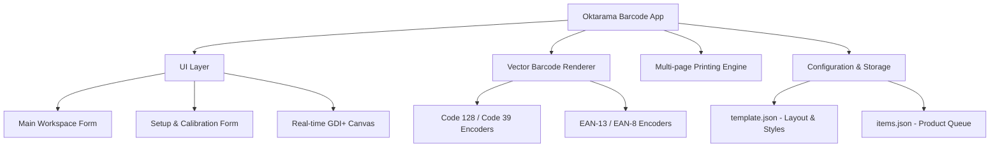

# 🏷️ Oktarama Barcode Generator

A modern, high-fidelity, and fully unlocked **standalone C# .NET Windows Forms** barcode label generator and sheet layout designer. 

This project was reverse-engineered from a classic Delphi native Win32 application and rewritten from scratch to deliver a premium, high-contrast visual interface, modular architecture, and precise millimeter-calibrated label sheet rendering.

---

## ✨ Features

- 🎨 **Sleek & Modern UI:** Designed with flat, high-contrast dark slate headers (`#1E293B`) and modern grid components, replacing outdated system grey palettes.
- 📐 **Millimeter-Precise Live Preview:** Double-buffered interactive canvas that scales and previews vector labels accurately on screen at any zoom level (`Auto Fit`, `75%`, `100%`, `150%`, `200%`).
- 🖲️ **Custom Print Slot Grid Selection:** Dynamic check grid card that lets you turn individual slots on a sheet layout on or off to skip printing specific areas (perfect for using partially printed label sheets).
- 🏷️ **Sticker Label Presets (Default: Tom & Jerry No. 108):** Quick preset selector configured out-of-the-box for Indonesian & Asian market standards (No. 108, 103, 121, 107, and 112).
- 🛡️ **Intelligent Collision Avoidance:** Vector engine dynamically shrinks or shifts barcode lines to prevent visual overlapping with price text on tight layouts.
- 📥 **Import/Export Data:** Fully standalone CSV and JSON list importing and exporting.
- 🗑️ **Grid-Based Quick Actions:** Inline row-deletion button (`🗑️` with a bright red `#EF4444` background) for extremely fast and responsive list editing.
- 💡 **Interactive Tooltips (Quick Help):** Hovering over controls shows custom Help balloons featuring detailed titles and tips.

---

## 🏗️ Architecture & Component Layers



### File Structure:
- `ProductItem.cs`: Product model with `Barcode`, `Name`, `Price`, and `CopyCount`.
- `LabelTemplate.cs`: Dimension parameters and standard template loader/saver.
- `BarcodeEncoder.cs`: High-fidelity vector encoding for retail barcodes.
- `BarcodeRenderer.cs`: Pixel-millimeter vector drawing conversions using `System.Drawing`.
- `FormMain.cs` & `FormMain.Designer.cs`: Master visual workstation, preview loops, and print spooling.
- `FormSetup.cs` & `FormSetup.Designer.cs`: Millimeter calibration tabs.

---

## 🚀 Getting Started

### Prerequisites
- **.NET 5.0 or 6.0 SDK** (Build)
- **.NET Desktop Runtime** (Run)

### 1. Build the Executable
Open your favorite command-line interface inside the project directory and compile:
```powershell
dotnet build
```
This compiles a standalone `.dll` / `.exe` target inside `bin\Debug\net5.0-windows\netbarcode_dotnet.exe`.

### 2. Launch the Application
Run the desktop window directly:
```powershell
dotnet run
```

---

## 🔧 Customizable Templates

You can modify configurations on-the-fly inside the **Label Setup** dialog:
- **General Page:** Preset stickers, column count, row count, margins (top, bottom, left, right), and gap coordinates in millimeters.
- **Barcode & Fonts:** Barcode type, bar height, narrow-to-wide ratios, text alignments, and specific Font families (e.g. Segoe UI).
- **Text Layout:** Currency symbols (`Rp`, `$`, `€`), promotion headers, and logo settings.

---

## 📄 License
This project is fully open source and standalone, freed from activation or commercial verification procedures.
